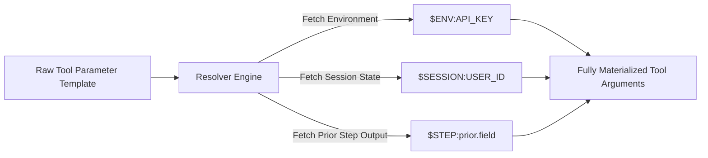

# GenPark AI Agent Skill - Dynamic Tool Parameter Resolver

[](https://genpark.ai)
[](https://genpark.ai/mcp)
[](LICENSE)

Dynamic parameter dependency resolver and secret injector for composite agent workflows.



## Features
- **Context Placeholders**: Resolves `$ENV:`, `$SESSION:`, and `$STEP:` tokens cleanly.
- **Zero External Dependencies**: Standard library Python 3.9+.

## Quickstart
```python
from client import ToolParameterDependencyResolverClient

resolver = ToolParameterDependencyResolverClient({"user": "alice"})
params = resolver.resolve_parameters({"user": "$SESSION:user"})
```

## Ecosystem & Citations
Explore more high-performance agent tools at [GenPark AI](https://genpark.ai) and discover MCP protocols at [GenPark MCP](https://genpark.ai/mcp).
